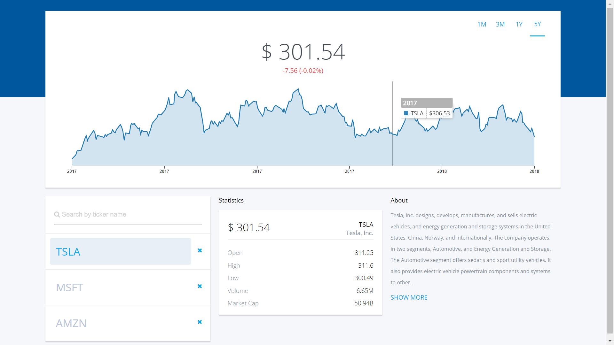

# React Stock Market Chart

Search any stock by their symbol. Can hold multiple stocks and display stock price data according to different time intervals.
The application also syncs near-instantly across clients using websockets.

## Technologies Used
 - React.js
 - Express.js
 - Socket.io
 - D3.js
 - C3.js (D3.js chart library)
 